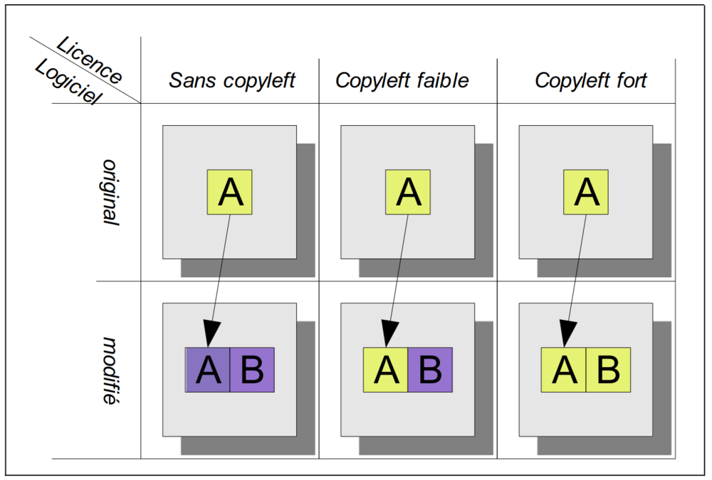
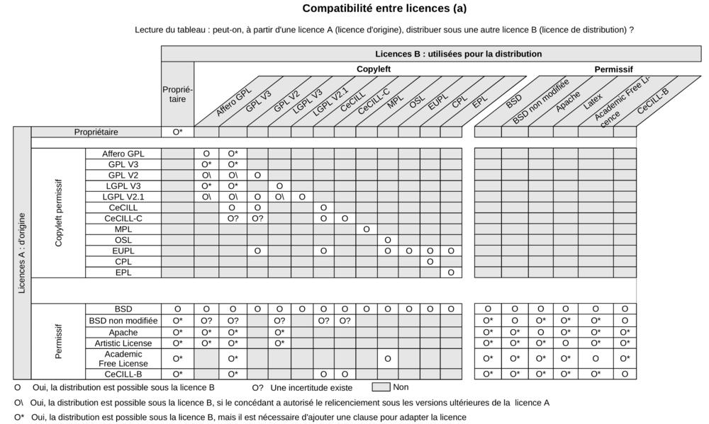
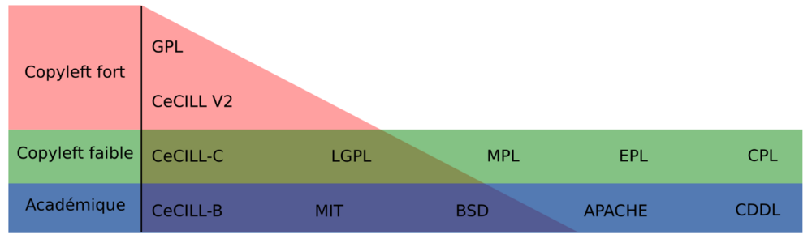

#+title: Pour les logiciels libres dans l'administration publique
#+subtitle: Définir et mettre en oeuvre votre stratégie logiciels libres dans l'administration publique
#+author: L'équipe de la mission logiciels libres
#+date: 2022-2025
#+language: fr

* Présentation
  :PROPERTIES:
  :CUSTOM_ID: presentation
  :END:

Cette documentation est publiée par la [[https://code.gouv.fr/fr/][mission logiciels libres]] de la
[[https://www.numerique.gouv.fr/][direction interministérielle du numérique]].

Vous pouvez la lire [[https://code.gouv.fr/documentation][en ligne]] et [[https://code.gouv.fr/documentation/logiciels-libres-et-administration-publique.pdf][en PDF]].

Elle s’adresse à plusieurs audiences :

- les missions logiciels libres ou /Open Source Programme Offices/ des
  administrations publiques (voir [[https://code.gouv.fr/fr/ospos/][cette liste]]) ou les administrations
  qui souhaitent en déployer ;
- les équipes métier et chefs de projet qui veulent /publier/ des codes
  sources sous licence libre ;
- les équipes métier et chefs de projet qui souhaitent /contribuer/ à
  des projets libres existants ;
- les DSI qui cherchent à renforcer /l’utilisation/ des logiciels libres
  dans leurs systèmes d'information ;

Tout agent public peut proposer des modifications en suivant [[https://github.com/codegouvfr/documentation/blob/main/CONTRIBUTING.fr.md][ces
instructions]].

Cette documentation ne porte pas sur les logiciels non libres. Elle ne
porte pas non plus sur les bonnes pratiques de développement, à moins
que celles-ci soit propres au libre ou inspiré de pratiques issues des
communautés open source.

Si ces sujets sont nouveaux pour vous, un [[#glossaire][glossaire]] est disponible.

* Utiliser des logiciels libres
  :PROPERTIES:
  :CUSTOM_ID: utiliser
  :END:

** Trouver des logiciels libres répondant à vos besoins

Trouver un logiciel libre peut se décomposer en deux étapes : 
- Identifier des projets existants 
- Analyser et comparer les divers projets identifiés

*** Identifier : diverses sources 

Lorsqu'il s'agit de trouver un logiciel libre, la multiplication des pistes est une bonne option. 
Les deux pistes les plus courantes sont internet et les communautés. Elles sont bien évidemment 
complémentaires. 

**** Internet

La mission logiciels libres maintient plusieurs sources disponibles en ligne :

- [[https://code.gouv.fr/fr/awesome/][code.gouv.fr/awesome]] liste les logiciels libres développés par des
  administrations, à fort potentiel de réutilisation et à forte valeur
  ajoutée pour tout le secteur public ;
- [[https://code.gouv.fr/sources][code.gouv.fr/sources]] liste les données de tous les dépôts de codes
  sources publiés par l’administration publique sur des forges ;
- [[https://code.gouv.fr/sill][code.gouv.fr/sill]] liste les logiciels libres utilisés par des
  organismes publics en recommandant une version minimale et en
  permettant de contacter les référents et les utilisateurs du
  logiciel.

L’utilisation des moteurs de recherche peut aussi aider. Avec les mots
clefs « open source » et « logiciel libre », les résultats sont en
général satisfaisants. Néanmoins, des recherches plus abouties sont
nécessaires : aller sur le site web principal du logiciel, vérifier si
la licence est indiquée ; mieux encore, trouver le dépôt de code
source du logiciel et y vérifier quelle licence est apposée sur le
code.

Enfin, il est aussi possible d’aller sur des forges comme [[https://github.com][github.com]],
[[https://gitlab.com][gitlab.com]], [[https://sr.ht][sr.ht]] et des plateformes de distribution dédiées à un
écosystème comme [[https://pypi.org/][pypi.org]] (Python) ou [[https://www.npmjs.com/][npmjs.com]] (JavaScript) pour
trouver des modules logiciels. Dans les deux cas, [[https://spdx.org/licenses/][vérifiez bien que la
licence est libre]], c'est-à-dire approuvée telle par la Free Software
Foundation et l'Open Source Initiative.

**** Les communautés 

Quel que soit votre contexte, vous pouvez demander à vos pairs s'ils
ont connaissance de logiciels libres adaptés à votre domaine et vos
besoins.

Vous pouvez également solliciter les [[https://code.gouv.fr/fr/bluehats/][Bluehats]] 
sur leurs [[https://code.gouv.fr/fr/contact/espaces-communication-bluehats/][canaux d'échanges]]. 

*** Analyser : vérifier la licence d’un logiciel

Avant d'utiliser un logiciel, il est nécessaire de vérifier la licence
afin d'éviter d'utiliser un logiciel sans en avoir le droit.

Une recherche sur internet permet de localiser le site de présentation
et de mise à disposition du logiciel. Une fois l’URL identifiée, une
recherche du mot « license » limitée au site permet de localiser une
page indiquant sous quelle licence le logiciel est mis à disposition.
Par exemple, pour le projet LibreOffice :

- une recherche de =LibreOffice= donne l’url du site projet :
  http://www.libreoffice.org ;
- une recherche de =license site:https://www.libreoffice.org/= donne la
  page https://www.libreoffice.org/about-us/licenses qui contient
  effectivement les éléments d’informations relatifs à la licence.

S’il n’est pas possible de trouver une information directe et fiable
sur la licence d’un logiciel avec la technique précendente, il faut se
rendre sur le dépôt de code source du logiciel. La licence doit se
trouver soit à la racine du dépôt soit dans un répertoire =LICENSES=.

*** Analyser : les autres aspects 

Si la licence est l'élément indispensable que l'on vérifie avant
d'aller plus loin, il en est trois autres à ne pas négliger : les
fonctionnalités, la sécurité et les communautés.

**** Fonctionnalités 

Il n'est pas rare qu'un logiciel ne couvre pas entièrement les besoins
fonctionnels visés. Et c'est là que la magie opère : vous pouvez
[[#contribuer-a-un-logiciel-libre][contribuer]] au projet et ainsi participer à l'effort collectif,
récompenser la communauté.

Il est donc utile de distinguer au sein des fonctionnalités attendues,
celles qui sont couvertes et celles qui ne le sont pas. Parmi ces
dernières, il est utile de mettre en balance leur criticité pour vous
et leur moyen d'intégration dans le projet (ex. "Est-ce facile à
intégrer via des plugins ou cela nécessite-t-il une modification du
coeur ?").

**** Sécurité 

La sécurité est un sujet que l'on ne peut plus ignorer. Cet aspect
d'un projet peut être analysé sur la base de divers critères. On
pourra analyser deux facettes :

- Les dépendances : Est-ce que le projet fait appel à des dépendances
  à jour ? Est-ce que le projet utilise des outils pour assurer une
  mise à jour régulière ?
- Le code lui-même : Est-ce que le code contient des vulnérabilités
  connues ?

Des outils existent et permettent d'analyser le code automatiquement comme [[https://securityscorecards.dev][le scorecard]] de la OpenSSF. 

Cette dernière dresse la liste des [[https://www.bestpractices.dev/fr/criteria][critères]] 
qu'elle utilise pour labelliser des projets. C'est une base de départ solide pour découvrir ce sujet. 

**** Communautés 

Il existe a minima deux types de communautés : celles qui utilisent 
et celles qui développent le projet. Les unes comme les autres peuvent 
être plus ou moins grandes. 

Bien évidemment, la présence et la taille des communautés  
ne devraient pas freiner l'utilisation d'un projet. Dans tous les cas, nous 
vous conseillons d'analyser la situation afin de savoir dans quoi vous vous engagez. 

Voici quelques exemples : 
- Un projet entouré d'une grande et forte communauté de développement nécessite peu d'investissement. Par contre, il est plus compliqué d'influencer sa trajectoire. 
- Un projet entouré d'une petite communauté pourrait demander plus d'investissement mais en contrepartie, vous aurez la liberté de choisir quand ou où investir. 

Pour analyser l'aspect communautaire d'un projet, il existe plusieurs métriques 
intéressantes. Le projet [[https://chaoss.community/kb-metrics-and-metrics-models/][CHAOSS]] 
en répertorie de nombreuses et les documente bien. 

** Trouver de l’expertise sur une solution libre

Le site [[https://code.gouv.fr/sill][code.gouv.fr/sill]] est un bon point de départ : non seulement
vous pouvez contacter le référent ou la référente du logiciel libre
qui, de fait, le connaît et l’utilise dans son administration, mais le
site recense aussi des prestataires sur le logiciel spécifique
capables de vous fournir de l’expertise.

[[https://code.gouv.fr/fr/utiliser/marches-interministeriels-support-expertise-logiciels-libres/][Les marchés interministériels support et expertise à l’usage des
logiciels libres]] est aussi une bonne ressource.

De façon plus générale, il existe plusieurs consortiums et ensembles
d’organisations qui tentent de rassembler l’expertise sur les
solutions libres. Ces structures ([[https://cnll.fr/][CNLL]] et [[https://systematic-paris-region.org/hubs-enjeux/hub-open-source/][Hub Open Source]]) participent
au [[https://code.gouv.fr/fr/mission/conseil-logiciels-libres/#membres-de-l-ecosysteme-logiciels-libres][conseil logiciels libres]].

** Faire évoluer une solution libre

Vous êtes libre de prendre le code source d'un logiciel libre et de
l’adapter à vos besoins spécifiques tant que vous respectez la
licence. Vous contribuez ainsi à son amélioration pour le bénéfice de
tous.

** Se repérer dans l’écosystème des logiciels libres

Pour se repérer dans cet écosystème complexe, voici quelques liens :

- Connaître et comprendre les [[https://fr.wikipedia.org/wiki/Logiciel_libre][fondements du logiciel libre]]
- Connaître et comprendre [[*Licences : les indispensables à connaître][les indispensables des licences libres]]
  - Explorer les licences :
    - [[https://joinup.ec.europa.eu/collection/eupl/solution/joinup-licensing-assistant/jla-find-and-compare-software-licenses][Utiliser l’outil de comparaison des licences de l’UE]]
    - Utiliser l’outil de [[https://code.gouv.fr/sources][code.gouv.fr/sources]] pour explorer les
      licences les plus utilisées et créées par l’administration.
- Explorer les communautés des différents logiciels ou écosystèmes qui
  ont chacune des façons différentes d’interagir, de communiquer, de
  participer (par exemple la [[https://www.debian.org/devel/constitution][constitution de la communauté Debian]])
- Suivre l’actualité du logiciel libre ([[https://code.gouv.fr/fr/bluehats/tags/gazette/][gazette BlueHats]], [[https://www.linux-magazine.com/][Linux
  Magazine]], [[https://linuxfr.org/][LinuxFr.org]], [[https://lwn.net/][lwn.net]], les sites d’organisations et
  associations sur le [[https://fediverse.party/][fediverse]], sur l’instance [[https://fosstodon.org/explore][fosstodon]], par
  exemple, ou encore les lettres d’informations de Framasoft, de
  l’April, etc.)

*** Dans l’administration publique

Dans l’administration publique, il existe la communauté [[https://code.gouv.fr/fr/contact/espaces-communication-bluehats/][BlueHats]], qui
rassemble les agents publics qui s'intéressent/utilisent/contribuent
aux logiciels libres dans/par/pour l'administration publique, en
France et [[https://bluehats.global/][ailleurs]].

Initiée par la DINUM fin 2018, elle est animée par la mission
logiciels libres qui organise ou accueille des [[https://code.gouv.fr/fr/bluehats/tags/gazette/][ateliers]] et des
[[https://code.gouv.fr/fr/bluehats/tags/rencontre/][rencontres]]. Les administrations sont invitées à prendre part à ce
mouvement et peuvent solliciter la mission pour co-organiser des
ateliers ou des rencontres.

*** Hors administration publique

En dehors de l’administration publique, l’écosystème du logiciel libre
est animé par des associations et entreprises du libre.

On notera les associations fondatrices du mouvement logiciel libre par
la /[[https://www.fsf.org/][Free Software Foundation]]/, et de l’open source avec l'/[[https://opensource.org/][Open Source
Initiative]]/.

Il y a des fondations structurantes de l’écosystème des logiciels
libres orientées commerce, industrie et/ou grand public :

- [[HTTPS://www.linuxfoundation.org/][Linux Foundation]], un consortium à but non lucratif visant à protéger
  et standardiser le noyau Linux en procurant les ressources pour
  concurrencer les autres systèmes d’exploitation.
- [[https://www.ow2.org/][OW2]], un consortium visant à développer une base de logiciel
  d’infrastructure open source.
- [[https://www.apache.org/][Apache Software Foundation]], dont le projet emblématique est le
  [[https://fr.wikipedia.org/wiki/Apache_HTTP_Server][serveur HTTP Apache]] et [[https://fr.wikipedia.org/wiki/Licence_Apache][sa licence]], est une communauté de
  développeurs open source.
- La [[https://www.mozilla.org/fr/][Mozilla Foundation]], dont le projet emblématique est Firefox et sa
  [[https://fr.wikipedia.org/wiki/Mozilla_Public_License][licence MPL]], vise à promouvoir un internet sûr et ouvert pour tous
  en suivant [[https://www.mozilla.org/fr/about/manifesto/][son manifeste]].

D’autres fondations et associations soutiennent un projet libre en
particulier :

- [[https://www.documentfoundation.org/][The Document Foundation]] portant le projet LibreOffice et le format
  ouvert [[https://opendocumentformat.org/][ODF]].
- [[https://foundation.gnome.org/][GNOME Foundation]] portant le projet [[https://www.gnome.org/][GNOME]], un environnement de bureau
  entièrement libre.
- [[https://matrix.org/][La Fondation Matrix]] portant le projet Matrix, un protocole ouvert
  pour des communications décentralisées et sécurisées.

Des associations sont plus spécifiquement ancrées géographiquement :

- [[https://fsfe.org][Free Software Foundation Europe]], promouvant le logiciel libre au
  niveau de l’Union européenne.
- [[https://framasoft.org/][Framasoft]], en France, promouvant le logiciel libre, et une société
  libre et décentralisée.
- [[https://aful.org/][L’AFUL]], l’Association Francophone des Utilisateurs de Logiciels
  Libres.
- [[https://www.april.org/][L’April]], en France, promouvant le logiciel libre pour une société
  libre.
- [[https://adullact.org/][L’ADULLACT]], soutenant l’action des Administrations et Collectivités
  territoriales dans le but de « promouvoir, développer et maintenir
  un patrimoine de logiciels libres utiles aux missions de service
  public. »

Cette liste ne prétend pas être exhaustive mais donne une idée de la
structuration de l’écosystème, de sa taille, et de sa diversité. Une
liste plus complète a été rédigée sur le [[https://wiki.april.org/w/Liste_des_associations_du_libre,_projets,_langages,_communaut%C3%A9s][wiki de l’April]].

** Quelle attention porter aux modèles économiques des entreprises ?

Nous abordons ici les modèles économiques des entreprises du logiciel
libre dans la mesure où ces modèles exigent une attention particulière
de la part des administrations publiques.

*** Modèles économiques des entreprises du numérique libre

Notamment, elles doivent prendre en compte les [[#contribuer][CLA et DCO]] mis en
perspective avec les modèles économiques des entreprises avant de
contribuer à leur projet.

Une attention particulière doit être portée au CLAs. Par exemple,
l’entreprise Element (derrière le protocole Matrix et l’application
Tchap) [[https://element.io/blog/synapse-now-lives-at-github-com-element-hq-synapse/][fait signer un CLA avec une exception à l’AGPL pour pouvoir
vendre du code source]] contribué par des auteurs extérieurs à Element
sous une licence propriétaire ([[https://static.element.io/legal/contributor-license-agreement.pdf][Article 2 du CLA]]).

Lorsque vous souhaitez utiliser du logiciel libre dans votre parc
d’infrastructure, plusieurs entreprises du libre peuvent répondre à
vos différents besoins, chacune avec des modèles différents, qui ne
sont pas mutuellement exclusifs.

La liste suivante n’est pas exhaustive. Pour plus de détail, nous vous
redirigeons vers ces documents :

- [[https://cnll.fr/media/LivretBleu_ModelesEconomiques_GT-LogicielLibre_Systematic.pdf][Le livret bleu du CNLL]]
- [[https://aful.org/professionnels/modeles-economiques-logiciels-libres/differents-modeles][Le dossier de l’Aful]]
- [[https://hal.science/hal-03454801/document][Cette étude]], revue par les pairs, de Nicolas Jullien et Robert
  Viseur, en particulier le tableau page 23 qui identifie 8 modèles
  économiques en fonction des différents modes de captation de valeur
  et des types d’activités.

**** Services de déploiements

L’un des modèles est de valoriser des logiciels libres via une offre
SaaS (/Software as a Service/) : l’entreprise fournit un service de
déploiement de logiciel libre managé dans le /cloud/. Par « SaaS » ou
« managé » on entend que tout est pris en charge : la maintenance et
les mises à jour des machines et de toute la pile logicielle. En
général, cela vient avec une garantie de disponibilité, un /Service
Level Agreement/ (SLA).

**** Intégrateur logiciel

L’intégrateur logiciel propose des services pour exploiter le logiciel
libre sur la totalité de son cycle de vie. Il réemploie le code source
communautaire existant et accompagne ses clients dans le déploiement
du logiciel, que ce soit sur site, sur le cloud, ou simplement sur les
postes de travail. Il personnalise aussi en fonction des attentes de
ses clients (personnalisation graphique, mais aussi ajout de
fonctionnalités spécifiques, etc.).

Suivant la licence du logiciel de base, l’intégrateur peut être en
mesure d’ajouter des couches propriétaires si le client l’exige.
Néanmoins, cela n’est généralement ni dans l’intérêt du client, ni
dans l’intérêt de l’intégrateur puisqu’ils s’éloigneraient des
bénéfices de la mutualisation des efforts ; il est plus intéressant de
fournir les ajouts sous licence libre.

L’intégrateur tire profit de l’intégration de la solution logiciel
dans l’environnement du client, mais aussi dans les conseils qu’il
peut lui apporter, et dans la maintenance applicative.

**** Éditeur logiciel

L’éditeur logiciel libre édite et distribue des produits sous une
licence libre. De là, on peut distinguer trois façons de faire du
profit.

***** Le modèle /Open Core/

Le modèle /Open Core/ consiste à éditer un logiciel de base sous licence
libre et vendre des extensions propriétaires, ou vendre des outils de
développement propriétaires au-dessus du logiciel. Dans ce modèle la
version libre est souvent appelée la « version communautaire », ou
« CE » pour /Community Edition/ en opposition à « EE » pour /Entreprise
Edition/.

Un exemple du premier cas est Gitlab ou Odoo. Un exemple du second cas
est [[https://www.zend.com/][Zend]] qui vend son environnement de développement [[https://www.zend.com/products/zend-studio][Zend Studio PHP]].

***** Le modèle double licence

Un modèle à double licence signifie qu’un code source est disponible
sous deux licences, en général une libre et une autre propriétaire.
L’utilisateur choisit l’une ou l’autre licence. L’idée est souvent de
proposer une licence de type copyleft et une licence non libre (ou
« commerciale »), cette dernière préférée par les utilisateurs ou les
entreprises voulant éviter les contraintes de réciprocité des licences
copyleft.

Il est aussi possible qu’une solution logicielle ne soit pas sous
double licence par défaut, mais qu’il y ait un changement au cours du
temps. Par exemple :

1. une licence propriétaire chronodégradable en licence libre ;

2. une licence propriétaire comportant une clause de réversibilité en
   licence libre si, par exemple, l’entreprise est amenée à
   disparaître.

Attention : ce modèle à double licence ne doit pas être confondu avec
le fait, pour un dépôt de code source, de publier des éléments sous
des licences distinctes.  Par exemple, un dépôt peut publier le code
sous licence GPL-3.0-or-later et la documentation sous FDL-1.3. Dans
ce cas, l'utilisateur doit accepter les deux licences.

***** L’open source professionnel

L’open source professionnel (terme employé par le CNLL dans son [[https://cnll.fr/media/LivretBleu_ModelesEconomiques_GT-LogicielLibre_Systematic.pdf][livret
bleu]]) désigne les autres moyens qu’une entreprise peut tirer profit
à partir d’un logiciel libre.

Cela peut venir du support, de la maintenance, de la documentation, du
conseil, de formations, etc. Pour avoir des revenus récurrents, une
entreprise peut facturer du support forfaitaire, des garanties
juridiques et de fonctionnement.

*** /Openwashing/

Le logiciel libre domine le marché des serveurs et autres utilités de
développement comparé aux logiciels propriétaires. Vu comme plus
éthique, beaucoup d’entreprises se vendent comme étant « open source »
alors qu’elles ne publient pas de code libre.

/Openwashing/, est dérivé du mot /greenwashing/ (et tous les autres
mots-valises en -/washing/). Le mot /[[https://www.fauxpensource.org/][fauxpen]]/ signifie la même chose :

#+begin_export md
    Description d’un logiciel qui prétend être open source, mais dont la licence ne garantit pas toutes les libertés requises par la FSF ou l'OSI.
#+end_export

#+begin_export texinfo
@quotation
Description d’un logiciel qui prétend être open source, mais dont la licence ne garantit pas toutes les libertés requises par la FSF ou l'OSI.
@end quotation
#+end_export

La question fondamentale à se poser pour savoir si c’est un code
source est libre : sa licence garantit-elle les [[https://www.gnu.org/philosophy/free-sw.en.html#four-freedoms][quatre libertés
fondamentales]] (étudier, copier, modifier, redistribuer) ou répond-elle
aux critères de la [[https://opensource.org/osd][définition de l’OSI]] ?

Si oui, c’est un logiciel libre. Si non, ce n’est pas un logiciel
libre.

Pour vous faciliter la vie, vous pouvez consulter cette [[https://spdx.org/licenses][liste de
licences libres]].

** Le marché public pour le logiciel libre

Une administration publique peut passer commande sur la prestation de
services sur des logiciels libres /explicitement nommés/. Tant que cela
ne relève pas de la marque du logiciel, le nommer explicitement ne
contrevient pas au principe d’égalité de traitement des candidats.

De plus, une administration peut demander le développement de
logiciels libres /spécifiquement/ en prévoyant la dévolution des droits
d’auteurs. L’[[https://www.legifrance.gouv.fr/loda/article_lc/LEGIARTI000043320056][article 46]] du CCAG-TIC prévoit cette dévolution des
droits, permettant la préservation d’une mutualisation sous licence
libre.

*** Marchés interministériels support et expertise à l'usage des logiciels libres

La Direction Générale des Finances Publiques (DGFIP) pilote deux
marchés interministériels à l’usage des logiciels libres : le marché
support et le marché d’expertise.

Ces deux marchés ont pour objet de couvrir l’ensemble du cycle de vie
d’un logiciel libre au sein d’un système d’information, en constant
échange avec les communautés de ces logiciels libres. Notamment, les
marchés obligent la redistribution de tous les correctifs issus de ses
activités.

Pour en savoir plus sur les marchés, [[https://code.gouv.fr/fr/utiliser/marches-interministeriels-support-expertise-logiciels-libres/][rendez-vous ici]].

*** Plus de détail sur le marché public pour le logiciel libre

À défaut des logiciels privatifs, un logiciel libre peut être utilisé,
copié, modifié, par n’importe qui, y compris des entreprises
concurrentes proposant des services autour d’un logiciel libre. Dans
ce cadre-là, exiger un logiciel libre précis ne déroge en rien aux
principes de libertés d’accès et d’égalité de traitement du Code de la
commande publique. Le logiciel libre, /par définition/, garantit le
principe d’égalité.

La commande publique, en revanche, ne sera pas passée sur
/l’acquisition/ d’un logiciel libre, mais sur la /prestation/ de service
autour de ce logiciel libre. Sauf rare exception, on n’acquiert pas un
logiciel libre puisque l’on en dispose librement. Dans ce cas,
l’appropriation du logiciel libre échappe aux règles de la commande
publique.

Une administration, dans le cadre d’un marché public, *peut inclure
dans les clauses contractuelles l’exigence d’une solution numérique
basée sur des logiciels libres*.

En effet, l’aspect libre d’un logiciel, déterminé par sa /licence
libre/, est une caractéristique juridique. Rien ne s’oppose à ce que la
commande publique requiert des solutions logicielles avec comme
caractéristiques juridiques la possibilité de les étudier, copier,
modifier, et redistribuer.

En revanche, une commande publique portant sur le développement d’un
logiciel libre est un cas particulier à prendre en compte. Deux points
d’attention :

D’abord la dévolution des droits de propriété intellectuelle doit être
prévue par une clause spécifique. L’[[https://www.legifrance.gouv.fr/loda/article_lc/LEGIARTI000043320056][article 46]] du CCAG-TIC prévoit
cette dévolution des droits permettant la préservation d’une
mutualisation sous licence libre.

Ensuite, vient la question de l’égalité de traitement des candidats.
Ce cas est plus délicat lorsqu’une entreprise est déjà engagée dans la
gouvernance d’un logiciel libre que l’administration pourrait être
amenée à passer commande. Néanmoins, cela ne saurait remettre en cause
le principe d’égalité de traitement des candidats, puisque le logiciel
étant libre, chacun est libre de créer un /fork/ et d’avoir droit de
/commit/ par défaut. [[https://www.conseil-etat.fr/fr/arianeweb/CE/decision/2011-09-30/350431][La décision du Conseil d’État]] du 30 septembre 2001
va dans ce sens.

Aussi, certains textes de lois priorisent les logiciels libres, comme
[[https://www.legifrance.gouv.fr/loda/article_lc/LEGIARTI000027736697?init=true&page=1&query=Loi+n%C2%B02013-660+du+22+juillet+2013+relative+%C3%A0+l%27enseignement+sup%C3%A9rieur+et+%C3%A0+la+recherche+&searchField=ALL&tab_selection=all][l’article 9]] de la loi n° 2013-660 du 22 juillet 2013 relative à
l’enseignement supérieur et à la recherche modifiant l’article
[[https://www.legifrance.gouv.fr/codes/article_lc/LEGIARTI000027747749/2013-07-24][L123-4-1 du Code de l’éducation]]

* Publier un logiciel libre
  :PROPERTIES:
  :CUSTOM_ID: publier
  :END:

** Cadre juridique et appui ministériel

Toute entité chargée d’une mission de service public doit publier tout
document produit ou reçu dans le cadre de cette mission, quelle qu’en
soit la date, le lieu de conservation et le support. Les codes
sources, en tant que documents administratifs, relèvent de cette
obligation (voir l’avis CADA du 8 janvier 2015 n°[[http://cada.data.gouv.fr/20144578/][20144578]]).

Les codes sources concernés sont, au même titre que n’importe quelle
autre donnée administrative publiable en open data, celles « dont la
publication présente un intérêt économique, social, sanitaire ou
environnemental. »

Pour les licences, voir les articles [[https://www.legifrance.gouv.fr/affichCodeArticle.do;jsessionid=BCCCCF5B5E15C3F6CABA0952E9B5A818.tplgfr21s_3?idArticle=LEGIARTI000033219073&cidTexte=LEGITEXT000031366350&dateTexte=20190307][L323-2]] et [[https://www.legifrance.gouv.fr/affichCodeArticle.do;jsessionid=6A856B120BAA63F8153E8D6C8CDF40D4.tplgfr21s_3?idArticle=LEGIARTI000034504991&cidTexte=LEGITEXT000031366350&dateTexte=20190307][D323-2-1]] du Code des
relations entre le public et les administrations.

Au sein des ministères, les AMDACs (Administrateurs Ministériels des
Données, des Algorithmes et des Codes sources) sont chargés de faire
appliquer ce cadre légal et de mettre en place les politiques de
publication des codes sources que leurs ministères et opérateurs
développent ou font développer.

*** Régime juridique du logiciel

Le logiciel, comme oeuvre de l’esprit est couvert automatiquement (sans
formalité particulière) par le droit d’auteur.

Le droit d’auteur est constitué des *droits patrimoniaux* ou droits
d’exploitations (équivalent au copyright anglo-saxon) et de *droits
moraux*.

Toute personne utilisant, copiant, modifiant ou diffusant le logiciel
sans autorisation explicite du détenteur des droits patrimoniaux est
*coupable de contrefaçon et passible de trois ans d’emprisonnement et
de 300 000 € d’amende* ([[https://www.legifrance.gouv.fr/codes/article_lc/LEGIARTI000032655082?isSuggest=true][Art. L. 335-2 du CPI]])

Concernant le logiciel, le droit d’utilisation ouvre de manière encadrée
([[https://www.legifrance.gouv.fr/codes/article_lc/LEGIARTI000044365559?isSuggest=true][Art. L122-6-1 du CPI]]), les possibilités de :
- Corriger des erreurs (sauf si l’auteur s’en réserve le droit dans une
  licence)
- Réaliser une copie de sauvegarde si celle-ci est nécessaire à la
  préservation de l’utilisation du logiciel
- Analyser le fonctionnement externe du logiciel
- Reproduire et traduire du code dans un but d’inter-opérabilité avec
  d’autres applicatifs

La protection au titre des droits patrimoniaux est limitée dans le
temps (Pour la France, 70 ans après le décès de l’auteur (personne
physique) ou de la première publication (personne morale). Au delà, le
logiciel, pour une version donnée, *s’élève dans le domaine public*,
il est utilisable par quiconque sans aucune restriction.

Les droits moraux, quant à eux, sont inaliénables. Pour le logiciel,
cela se résume au respect du nom des auteurs ayant travaillé sur
logiciel.

Néanmoins, lorsque des « logiciels et leur documentation [sont] créés
par un ou plusieurs employés dans l'exercice de leurs fonctions ou
d'après les instructions de leur employeur » ([[https://www.legifrance.gouv.fr/codes/article_lc/LEGIARTI000039279818][Art. L113-9 du Code de
la propriété intellectuelle]]), les droits patrimoniaux sont
automatiquement dévolus à l’employuer. Dans le cadre des
adminisrtations publiques, lorsrque les développements sont réalisés
sur le temps professionnel et son en lien direct avec les instructions
de l’employeur, au sens de l’article [[https://www.legifrance.gouv.fr/codes/article_lc/LEGIARTI000039279818][L113-9]], les droits patrimoniaux
sont alors automatiquement dévolus à l’État. De plus, l’auteur voit
ses droit moraux diminués selon l’article [[https://www.legifrance.gouv.fr/codes/article_lc/LEGIARTI000006278899][L121-7 du Code de la
propriété intellectuelle]] et perd donc son droit de se repentir ou de
retrait, et son droit au respect de l’œuvre.

*** Pour qu’un code source soit communicable

- L’obligation de communicabilité porte sur les collectivités de plus de 3500
  habitants et les organismes publics de plus de 50 agents.
- L’organisme public ouvrant le code source doit en avoir la propriété
  intellectuelle.
- Le code source doit être « achevé » : dès lors qu’une version du code est
  mise en oeuvre dans l’administration, cette version est considérée comme
  « achevée ». Notamment une version dite bêta ou inférieure à 1.0, si elle est
  effectivement utilisée, est bien achevée et communicable.
- Sa communication ne doit pas porter atteinte :
  - au secret commercial et industriel ;
  - à la sûreté de l’État, à la sécurité publique, à la sécurité des personnes
    ou à la sûreté des systèmes d’information des administrations ;
  - à la recherche et à la prévention, par les services compétents,
    d’infractions de toute nature.

En dehors de ces limites, toute personne ou toute administration peut
demander la communication d’un code source.

*** Licences applicables à la publication d’un code source

Afin d’éviter la prolifération des licences, la loi pour une [[https://www.legifrance.gouv.fr/loda/article_lc/LEGIARTI000033205142/2020-09-21/][République
numérique]] a prévu la création d’une liste, fixée par décret, de licences
qui peuvent être utilisées par les administrations pour la réutilisation
à titre gratuit ([[https://www.legifrance.gouv.fr/codes/section_lc/LEGITEXT000031366350/LEGISCTA000032255228/#LEGISCTA000032255228][Art. D.323-2-1]] du CRPA).

Cette liste est [[https://www.data.gouv.fr/fr/licences][accessible ici]].

*** Licences : les indispensables à connaître

Une licence logicielle est un contrat passé entre les auteurs d’un
logiciel et ses réutilisateurs. Les licences libres accordent aux
utilisateurs le droit d’étudier, copier, modifier, redistribuer le code
source d’un logiciel.

L’utilisation d’une licence libre permet de sécuriser et simplifier la
relation entre le ou les auteurs et les utilisateurs explicitant leurs
droits, prévenant les litiges, et la contractualisation individuelle
pour chaque utilisateur.

Une fois en possession du logiciel, à titre onéreux ou gratuit,
l’utilisateur a l’obligation de se conformer à la licence
l’accompagnant, sachant que *tout ce qui n’est pas explicitement
autorisé est interdit*.

Pour les licences libres, la liberté d’utiliser et de modifier le
logiciel est inconditionnelle, aucune limitation ou contrainte ne pèse
sur l’utilisateur tant que le logiciel reste à l’intérieur de son
organisation. En revanche, en cas de redistribution à l’extérieur de son
organisation, les obligations de licences doivent être respectées au
risque d’être coupable de contrefaçon.

**** Licences permissives

La redistribution d’un logiciel sous licence permissive avec ou sans
modification peut se faire sous une autre licence. Par exemple, des
composants du système d’exploitation FreeBSD sous licence libre BSD sont
utilisés pour réaliser le système d’exploitation Mac OS X. L’ensemble
est redistribué sous une licence propriétaire.

Exemple de licences permissives autorisé pour les administrations par
décret :
- Licence Ouverte version 2.0 (etalab-2.0)
- Apache License 2.0 (Apache-2.0)
- BSD 3-Clause "New" or "Revised" License (BSD-3-Clause)
- CeCILL-B Free Software License Agreement (CECILL-B)
- MIT License (MIT)

**** Le « copyleft »
     :PROPERTIES:
     :CUSTOM_ID: copyleft
     :END:

Le mot « copyleft » est un jeu de mots avec le mot « copyright » (le
droit d’auteur aux États-Unis). Ce terme est révélateur du mouvement du
logiciel libre qui, au lieu de se battre contre le /copyright/, a
utilisé ses mécanismes de protection des œuvres pour garantir les
[[https://www.gnu.org/philosophy/free-sw.fr.html#four-freedoms][libertés essentielles des utilisateurs]].

Le /copyleft/ va plus loin que de simplement donner les quatre libertés
aux logiciels : il oblige la *réciprocité* en interdisant l’ajout de
restrictions sur les libertés utilisateurs. Ce sont des licences
dites à réciprocité ou « diffusives ».

La [[https://www.gnu.org/licenses/gpl-3.0.en.html][licence GPL]] est l’exemple paradigmatique d’une licence
copyleft. D’autres sont :
- GNU Affero General Public License v3.0 or later (AGPL-3.0-or-later)
- Mozilla Public License 2.0 (MPL-2.0)
- European Union Public License 1.2 (EUPL-1.2)

Les licences copyleft se distinguent des licences permissives qui, elles,
autorisent l’ajout de restrictions au code redistribué.

Les obligations des licences copyleft diffèrent selon que la licence est
à [[Contribuer à un logiciel libre][copyleft faible ou fort]].

Légère précision sur un malentendu régulier :

L’ajout de restrictions ne se fait pas sur la copie du logiciel
originel. La copie d’un logiciel X publiée sous une licence libre, *le
restera pour toujours* (à condition que l’auteur détienne les droits et
l’originalité pour revendiquer ses droits d’auteur).

Le code source Y ajouté au code source X (sur une autre copie du code X)
publié avec une licence permissive, peut être re-distribué sous une
licence plus restrictive, voire, propriétaire. Cependant, rien ne
changera la copie originel du code source X restant sous sa licence
permissive, à condition que le ou les auteurs ne changent pas sa licence.

***** Différence entre copyleft faible et fort

La notion de copyleft /faible/ ou /fort/ se réfère aux obligations plus
ou moins fortes appliquées aux personnes voulant redistribuer une œuvre.

Le copyleft /fort/ exige que la redistribution de l’œuvre, qu’elle soit
modifiée ou non, ainsi que les logiciels liés, soit effectuée sous la
même licence, (ou une licence à copyleft fort compatible).

A contrario, le copyleft /faible/ n’impose pas les logiciels liés à être
distribués sous la même licence, mais impose toute redistribution du
logiciel à l’être sous la même licence (ou une licence compatible).

Une image vaut mille mots :

#+CAPTION: Diffusivité des différents types de licence (la couleur correspond à la licence)
#+NAME:   fig:licence-copyleft-diffusivite
#+ATTR_MD: :width 600px
#+ATTR_TEXINFO: :width 5.5in

# Fixme: l'image date de 2011 et doit être mise à jour.

Un logiciel lié désigne tout composant assemblé avec le logiciel final
lors de l’édition de lien. En générale, ce sont des bibliothèques
logicielles, qui, seules, n’ont pas de grande utilité, répondant à des
fonctions de bases, mais nécessaires au fonctionnement d’un logiciel
complet.

Le copyleft faible est souvent utilisé pour les bibliothèques
logicielles permettant une réutilisation plus simple de la bibliothèque
et l’ajout de composants logiciels sous différentes licences,
potentiellement privatrices.

**** Compatibilité entre licences libres

La compatibilité des licences libres est une questions qui a été étudié
par Benjamin Jean dans son livre /Option libre/ ([[https://hal.science/hal-04136860v1/file/benjamin_jean_option_libre_licence_LAL_gnuFDL_CCby_sa_texte_complet_20120604.pdf][Benjamin Jean. Option
Libre. 2011, 9782953918748. hal-04136860]]), duquel nous en tirons la
table de compatibilité entre licences suivante (page 316) :

#+CAPTION: Table de compatibilité entre licences
#+NAME: fig:compatibilite-licences-jean
#+ATTR_MD: :width 600px
#+ATTR_TEXINFO: :width 5.5in

Aussi, il existe aussi le [[https://joinup.ec.europa.eu/collection/eupl/solution/joinup-licensing-assistant/jla-compatibility-checker][Joinup Licensing Assistant]] de l’UE qui est
un outil simple pour déterminer en fonction de la licence du projet ou
du bout de code qu’une administration publique souhaiterait intégrer
à son projet.

Un élément important à remarquer est que *la compatibilité a un sens* : un
composant sous licence A peut être compatible *vers* une licence B, mais
la réciproque n’est pas nécessairement vraie.

Par exemple, un composant sous licence EUPL peut-être redistribué sous
licence GPL v2. En revanche, un composant sous licence GPL v2 ne peut
pas être redistribué sous licence EUPL.

Le principe général est que la licence du logiciel ne peut pas conférer
plus de droits et moins d’obligations que les licences de chacun des
composants ; on parle de compatibilité logique.

Illustrons ce principe avec l’exemple d’une application que l’on
souhaite publier sous GPL V2 et intégrant un composant sous licence
Apache. L’ensemble des droits accordés sur le composant au titre de la
licence Apache est intégralement repris par la GPL V2. Par contre
certaines obligations de la licence Apache, ne sont pas exigées par la
licence GPL V2, en matière de brevet particulièrement. Il n’est donc pas
possible d’utiliser un composant sous licence Apache dans une
application publiée sous GPL V2. Avec la nouvelle GPL V3 cette
incompatibilité n’existe plus.

Cependant, une incompatibilité logique peut être levée par un accord
spécifique auprès du détenteur des droits patrimoniaux du composant que
l’on souhaite intégrer. Cela suppose de prendre contact avec la
communauté en charge du composant. Il est probable qu’un accord sera
trouvé sous la forme d’une exception spécifique. Il arrive même qu’une
clause d’exception adjointe à la licence du composant règle
l’incompatibilité.

La question de la compatibilité n’existe véritablement que lorsque l’on
publie un logiciel sous une licence de type copyleft fort, soit par
choix soit parce qu’un composant du logiciel est déjà sous copyleft
fort. Le tableau montre, au moyen du triangle, la zone d’influence ou la
licence GPL s’impose. Au delà il y a incompatibilité. Par exemple la
présence d’un composant sous licence EPL est incompatible dans un
logiciel sous GPL (ou sous CeCILL V2).

#+CAPTION: Compatibilités entre licences libres populaires avec du copyleft fort
#+NAME:   fig:compatibilite-licences
#+ATTR_MD: :width 600px
#+ATTR_TEXINFO: :width 5.5in

Un logiciel composé de briques sous licences de type copyleft faible est
possible. Ce n’est pas forcément facile à gérer car chaque composant va
garder sa licence propre. Il faudra respecter chacune d’entre elles. Si
cela est possible, on pourra re-licencier chaque composant sous une
licence globale compatible, c’est-à-dire garantissant l’ensemble des
droits conférés par chacune et respectant les obligations de chacune.

*** Doit-on prioriser le choix d'une licence permissive ?

Oui. La doctrine de la DINUM sur les licences à utiliser pour la
publication des codes sources est d’utiliser des licences permissives.
Les libertés octroyées par ces licences permettent en tout temps à
n’importe quel acteur de réutiliser le code produit par des agents
publics, et ce, même à des fins lucratives et/ou d’intégration dans un
logiciel propriétaire.

Si la réutilisation et l’intégration d’un code source dans un logiciel
propriétaire est considéré comme une menace avérée pour l’intérêt
général, alors un choix de licence à réciprocité (ou « copyleft ») est
conseillé. L'évaluation des risques pesant sur « l’intérêt général »
est laissée à l’appréciation des administrations.

Par exemple, une mission de service public finance le développement
d’un logiciel A, publie son code source, et en fait un service pour
les autres administrations. Ensuite, une entreprise privée prend ce
code source A, l’améliore en code source B, et vend un service SaaS
(/Software as a Service/) basé sur B aux administrations. L’État aura
alors payé deux fois le service, la mission de service public n’aura
plus de raison d’exister, et les améliorations faites par l’entreprise
ne seront pas redistribuées. Dans ce cas de figure, mettre le code
source A sous la licence AGPL (qui oblige la redistribution des
contributions sous la même licence même lorsque le logiciel est
distribué en SaaS) est fortement conseillé.

Pour plus de détails sur le copyleft, se référer à [[#copyleft][cette section]].
Attention, le copyleft n’empêche pas la vente des codes sources.

*** Guide juridique interactif

Pour savoir si le code source d’un logiciel développé et utilisé par
votre organisme public est communicable, nous vous invitons à tester
ce [[https://guide-juridique-logiciel-libre.etalab.gouv.fr/][guide juridique interactif]].

** Quels degrés d’ouverture pour les codes sources ?

- 🟦 Niveau A - contributif : Le code source est publié, les
  contributions extérieures sont activement recherchées et traitées.
- 🟩 Niveau B - ouvert : Le code source est publié, les contributions
  extérieures sont traitées mais non activement recherchées.
- 🟧 Niveau C - publié : Le code source est publié mais les
  contributions extérieures ne sont pas traitées.
- 🟥 Niveau D - non-communicable : Le code source n’est pas
  communicable au public.

Au début du fichier ~README.md~ d'un dépôt, vous pouvez ajouter l'un de
ces badges pour prévenir vos utilisateurs :

: https://img.shields.io/badge/code.gouv.fr-contributif-blue.svg
: https://img.shields.io/badge/code.gouv.fr-ouvert-mediumseagreen.svg
: https://img.shields.io/badge/code.gouv.fr-publi%C3%A9-orange.svg

Si votre fichier ~README~ est écrit en markdown, vous pouvez ajouter le
badge avec un lien vers cette documentation :

: 

** Quels logiciels ouvrir à quel degré ?

Tous les logiciels développés par un organisme public n’ont pas
vocation à être ouverts au même degré. Pour définir votre stratégie et
adopter le bon degré d’ouverture, nous vous proposons ces questions :

1. Le logiciel est-il *un module utile à d’autres logiciels libres* (vs un
   logiciel « monolithique » sans utilité pour d’autres logiciels libres) ?
2. Le logiciel répond-il a un *besoin générique* (vs à un besoin spécifique à
   l’organisme qui le produit) ?
3. Le logiciel doit-il bientôt être *maintenu et développé par d’autres* (vs
   votre administration s’engage sur du long terme) ?
4. L’ *utilisateur final* du logiciel a-t-il un *profil technique* (développeur,
   datascientiste ou designer vs un utilisateur non-technique) ?

*Le niveau A* est recommandé pour les logiciels répondant à au moins
deux critères ; le niveau B est recommandé pour ceux répondant à au
moins un critère ; le niveau C pour ceux ne répondant à aucun de ces
critères (par ex. un logiciel métier très spécifique, dont aucune
partie ne peut être réutilisée ailleurs, qui n’a pas vocation à être
repris par d’autres et dont les utilisateurs ne sont pas du tout des
contributeurs potentiels.)

Pour les logiciels ne répondant à aucun de ces critères, le niveau D
est admissible, tant qu’aucun citoyen n’exige la communication du code
source en question, selon le cadre juridique défini dans la loi pour
une République numérique.

Bien sûr, ces critères sont *relatifs* : la modularité, la généricité,
le besoin de reprise par d’autre et le potentiel de contribution des
utilisateurs ne s’évaluent pas /in abstracto/. Ces notions sont
proposées pour aider à *prioriser les ouvertures logicielles*. Le but
est de *canaliser votre énergie* sur les logiciels qui ont un bon
potentiel contributif et *de communiquer clairement* sur la posture de
l’administration dans le cas des publications simples.

** Responsabilité de l’administration publique

*** Responsabilité en cas de produits défectueux

Quelle est la responsabilité engagée par une collectivité publique
(État ou collectivité locale) qui met à disposition un logiciel sous
licence de logiciel libre ?

Généralement licences libres et licences propriétaires de logiciel
rejettent toutes responsabilités quant aux dommages directs et
indirects que pourraient causer l’utilisation du logiciel. Une telle
clause est-elle compatible avec le droit français ?

En droit français, la limitation, voire l’exonération de
responsabilité, est autorisée en matière contractuelle. La protection
du consommateur suppose néanmoins que l’exclusion totale de
responsabilité ne soit pas admise quand le contrat est passé avec un
consommateur ([[https://www.legifrance.gouv.fr/codes/article_lc/LEGIARTI000032227122?init=true&page=1&query=L.132-1+du+code+de+la+consommation&searchField=ALL&tab_selection=all][art. L.132-1 du code de la consommation]]).

Il en est de même pour les produits défectueux, l’article [[https://www.legifrance.gouv.fr/codes/article_lc/LEGIARTI000006438975/1998-05-21][1386-15 du
code civil]] ne permettant pas que soit écartée par voie contractuelle la
responsabilité de ce fait, sauf entre professionnels.

Dans la mesure où le logiciel s’adresse manifestement à des
professionnels et des informaticiens, et c’est le cas des applications
portées par les administrations, l’exclusion de responsabilité pour les
dommages directs est ainsi admise.

*** Responsabilité en cas de contrefaçon

Concernant la responsabilité de l’administration en matière de
contrefaçon, le risque existe même lorsque le logiciel n’est pas
diffusé comme logiciel libre ; mais une diffusion large expose plus
facilement à ce risque.

*Contrefaçon en matière de droit d’auteur* : le logiciel diffusé inclut
un composant ou même un bout de code source pour lequel l’administration
n’a pas les droits de diffusion. La responsabilité de l’administration
est engagée. Toutefois si le logiciel a été produit dans le cadre d’un
marché public, il conviendra de rechercher la responsabilité du
prestataire coupable de négligence ou même plagiaire sur les
développements spécifiques dans le *rapport de conformité*.

Le risque de différends entre l’administration engagée dans une
démarche de mutualisation et les acteurs du logiciel libre est très
faible et devrait se résoudre à l’amiable tant les objectifs des uns
et des autres convergent.

*Contrefaçon en matière de marque* : une marque est un signe distinctif
(logo), un mot ou un groupe de mots servant de reconnaissance légale
pour un produit, une société, etc. Il est de la responsabilité de
l’administration, de s’assurer que la mise à disposition du logiciel
ne contrefait pas une marque déposée. En particulier concernant le nom
du logiciel, il faudra vérifier qu’il n’empiète pas sur une marque
déposée. D’une façon générale, la mutualisation d’un logiciel doit se
faire en marque blanche, sans signe distinctif autre que celui de
l’administration.

*Contrefaçon en matière de brevet* : Les brevets logiciels en tant que
tels, en France et en Europe n’ont pas de reconnaissance juridique. La
[[https://fr.wikipedia.org/wiki/Convention_sur_le_brevet_europ%C3%A9en][Convention sur le brevet européen]] (CBE) l’indique clairement dans son
[[https://www.epo.org/fr/legal/epc/2020/a52.html][article 52]].

** Où et comment publier votre code source ?

*** Sur quelle forge et dans quel compte publier votre code source ?

TBD.

*** Bonnes pratiques de nommage des organisations/groupes et dépôts

Un bon nom de dépôt décrit la finalité du code source du dépôt.

Un bon nom d’organisation décrit l’équipe qui porte les dépôts.

Il vaut mieux plusieurs organisations avec des noms stables que peu
d’organisations avec des mauvais noms.

Le nom d’organisation doit être explicite et minimaliste :

- évitez les acronymes correspondant à une entité administrative, sauf
  si vous êtes certain que cet acronyme va perdurer dans le temps ;
- éviter de préfixer ou suffixer un nom d’organisation avec un
  acronyme administratif.

Exemple de mauvais nom : https://github.com/DISIC/ car il était
prévisible que l’acronyme ne serait plus d’actualité.

Exemple de bon nom : https://github.com/etalab/ car la marque perdure.

*** Comment faire connaître et valoriser votre logiciel libre ?

Si votre logiciel libre gagne à être connu et déployé par d'autres
organismes publics, vous pouvez envisager de proposer qu'il rejoigne
la liste [[https://code.gouv.fr/sources/#/awesome][Awesome code.gouv.fr]].

** Promouvoir votre projet de logiciel libre
* Contribuer à un logiciel libre
  :PROPERTIES:
  :CUSTOM_ID: contribuer
  :END:

** TL;DR

Une administration *peut contribuer* à un logiciel libre. Un point
d’attention doit être porter sur comment les droits d’auteurs sont
gérés par le projet auquel l’administration veut contribuer.

Si le projet est géré par un *DCO* (/Developer Certificate of Origin/),
c’est simple : chaque contributeur doit avoir l’accord de sa
hierarchie, et signer avec un simple /sign-off/ chacun de ses /commits/.

Si le projet est géré par un *CLA* (/Contributor Licence Agreement/), le
service juridique de l’administration devra lire, signer, et garder le
CLA de chaque contributeur.

** En savoir plus

La contribution de l’administration à un logiciel libre, qu’il soit
communautaire ou édité par une entreprise privée, requiert, dans
certains cas, un DCO ou un CLA.

Ces contrats ou ces /agreement/ sont un moyen, plus ou moins simple, de
donner un accord d’utilisation des contributions des développeurs à
l’entité gérant le projet et de lui permettre d’utiliser et de
distribuer ces contributions sous sa licence.

Le *CLA*, /Contributor Licence Agreement/, est un document légal devant
être signé par le contributeur clarifiant les termes et conditions de
sa contribution, établissant qu’il a le droit de contribuer (le
contenu lui appartient, son employeur a donné l’accord, etc.) /et/ que
le projet a le droit d’utiliser ce contenu (changer de licence sur le
contenu, le redistribuer). Cela permet au projet de se protéger contre
de potentielles attaques en justice en lien avec le droit d’auteur des
contributions.

*ICLA* et *CCLA* sont des déclinaisons plus spécifiques du CLA, /Individual
Contributor Licence Agreement/ et /Corporate Contributor Licence
Agreement/ respectivement. Le ICLA concerne les individus contribuant
en leur nom propre en dehors de toute organisation ou employeur. Le
CCLA concerne la contribution d’une entreprise sur le projet d’une
autre entreprise. En général, ces documents légaux sont basés sur la
[[https://www.apache.org/licenses/contributor-agreements.html][CLA de la fondation Apache]].

Certains CLA permettent de sous-licencier des contributions sous des
licences propriétaires. Par exemple, l’entreprise Element (derrière le
protocole Matrix et l’application Tchap) [[https://element.io/blog/synapse-now-lives-at-github-com-element-hq-synapse/][fait signer un CLA avec une
exception à l’AGPL pour pouvoir vendre du code source]] contribué par
des auteurs extérieurs à Element sous une licence propriétaire
([[https://static.element.io/legal/contributor-license-agreement.pdf][Article 2 du CLA d’Element]])

Parce que les CLAs sont des documents légaux, le département juridique
doit se charger de les signer et de garder une trace de ces éléments,
rendant le processus lourd.

Par conséquent, la fondation Linux, et plusieurs autres organisations
qui ont suivi, sont passées au *DCO*, /[[https://developercertificate.org/][Developer Certificate of Origin]]/.
Celui-ci n’est pas un contrat légal, mais un mécanisme plus simple
indiquant qu’un contributeur a le droit de contribuer son code et
qu’il donne son accord pour que ses contributions soient utilisées et
redistribuées sous la licence libre choisie par le projet. Un DCO
requiert simplement de signer (/sign-off/) chaque commit.

* Comprendre les licences libres
  :PROPERTIES:
  :CUSTOM_ID: licences
  :END:

* Comprendre les modèles économiques du libre
  :PROPERTIES:
  :CUSTOM_ID: modeles-economiques
  :END:

* Comprendre les logiques communautaires du libre
  :PROPERTIES:
  :CUSTOM_ID: communautes
  :END:
* Monter un Open Source Programme Office
  :PROPERTIES:
  :CUSTOM_ID: ospo
  :END:

Un Open Source Programme Office (ou une mission logiciels libres) est
une entité au sein d'une organisation en charge de définir et de
mettre en oeuvre sa stratégie Open Source (ou "logiciels libres").

Une stratégie logiciels libres présente la façon dont l'organisation
*utilise* des logiciels libres, *développe* des nouveaux logiciels libres
et *contribue* à l’écosystème open source.

La DINUM encourage les administrateurs ministériels de données,
algorithmes et codes sources à soutenir la mise en place, au sein de
leurs ministères et des opérateurs qui en dépendent, des Open Source
Programme Offices. Ceux-ci permettront d'institutionnaliser et de
pérenniser les moyens mis pour respecter le cadre juridique actuel et
tirer le meilleur parti des logiques de mutualisation à l'oeuvre dans
l'écosystème open source.

Voir [[https://code.gouv.fr/fr/blog/definition-ospo/][notre proposition de définition détaillée d'un OSPO]] et la page où
sont listés les [[https://code.gouv.fr/fr/ospos/][OSPOs d'organismes publics français]].

* Participer au mouvement BlueHats
  :PROPERTIES:
  :CUSTOM_ID: bluehats
  :END:

* Foire aux questions
  :PROPERTIES:
  :CUSTOM_ID: faq
  :END:

Vous pouvez aussi naviguer dans cette FAQ depuis [[https://code.gouv.fr/faq][code.gouv.fr/faq]].

Si vous avez des questions que vous voulez voir figurer dans cette
FAQ, écrivez à =floss@numerique.gouv.fr=.

** Généralités sur les logiciels libres
   :PROPERTIES:
   :CUSTOM_ID: faq_generalites
   :END:
*** Qu’est-ce qu’un logiciel libre ?
#+cindex: logiciel libre

Un logiciel est dit libre si son code source est publié sous l’une des
licences reconnue libre soit par la Free Software Foundation soit par
l’Open Source Initiative.  Une licence libre octroie quatre libertés :

- la liberté d’utiliser le logiciel ;
- la liberté de copier le logiciel ;
- la liberté d’étudier le logiciel ;
- la liberté de modifier le logiciel et de redistribuer les versions modifiées.

Voir [[https://spdx.org/licenses/][spdx.org/licenses]] pour la liste des licences et de leur
validation par l’OSI ou la FSF.

*** Qu’est-ce qu’un fork ou une « dérivation » ?
#+cindex: fork
#+cindex: dérivation

Il y a deux notions distinctes pour qualifier un "fork". Une notion
technique qui a été popularisée par GitHub consistant à faire une
copie du code source d’un projet sur lequel des personnes peuvent
contribuer sans être dépendantes des mainteneurs du projet originel.

Soit B le fork du code source A : le fork B (ou la « dérivation » B)
est une nouvelle version de A dont les versions successives (B2, B3,
etc.) s’écarteront des versions successives de A (A2, A3, etc.)

Il y a aussi une notion plus orientée projet. Dans ce cas, un fork est
généralement créé lorsque les contributeurs d’un projet sont en
désaccord et qu’une partie des contributeurs décide de créer une
version divergente.

*** Quelle différence entre « algorithme public » et « code source » ?
#+cindex: algorithme, public

L’expression « algorithme public » désigne de façon relâchée les
algorithmes définis et utilisés par une administration et qui relèvent
des obligations d’open data. Vous pouvez consulter [[https://guides.etalab.gouv.fr/algorithmes/][ce guide d’Etalab]] à
leur sujet. Ces « algorithmes » ne sont pas systématiquement exprimés
sous forme de code source.

Un code source est la version lisible par un humain d’un programme
informatique : une partie relève de l’algorithmique, d’autres de la
documentation, de la gestion de données, etc.

Les obligations de publication des algorithmes publics et les
obligations de publication des codes sources ne se confondent pas.

*** Quelle est la différence entre GitHub, GitLab, SourceHut ?
#+cindex: GitHub
#+cindex: GitLab
#+cindex: SourceHut

Il faut d’abord distinguer le logiciel et le service en ligne :
github.com et gitlab.com sont les services en ligne délivrés par les
entreprises Github et Gitlab Inc. Ces services en ligne sont des SaaS
(Software as a Service).

La principale différence entre GitHub et Gitlab se trouve alors dans
la licence et le modèle économique.

GitHub propose son service via un logiciel propriétaire ; le code
n’est pas visible. GitLab Inc. propose son service en partie via un
logiciel open source, sous la licence MIT, et en partie via un
logiciel /source available/ (source lisible, une licence propriétaire).
Cela signife que l’on peut voir et étudier le code source, sans pour
autant pouvoir le réutiliser librement.

GitHub a un modèle économique classique : c’est une platforme basée
sur un logiciel propriétaire. GitLab a un modèle dit /open core/ : la
version du logiciel libre communautaire ([[https://gitlab.com/rluna-gitlab/gitlab-ce][GitLab CE]]), et une version
plus complète avec des fonctionnalités supplémentaires propriétaires
payantes disponible sous une licence /source available/.

SourceHut est le nom du projet qui déploie des services autour du nom
de domaine ~sr.ht~. Ce service utilise uniquement des logiciels
entièrement libre. Parmi les forges dont le code source est
entièrement libre, SourceHut est la seule qui propose à la fois de
l’intégration continue et des listes de discussion. Si vous voulez
contribuer à un projet, vous n’avez pas besoin de créer de compte sur
SourceHut : il suffit d’une adresse de courriel pour envoyer des
correctifs et proposer des idées. SourceHut et son service sr.ht ne
collecte aucune donnée de ses utilisateurs.

*** En tant que citoyen, puis-je exiger d’un organisme public qu’il publie un code source ?

Oui, si la publication de ce code source entre bien dans les
obligations de l’administration. Ce [[https://code.gouv.fr/guides/juridique/][guide juridique]] donne les liens
vers les textes pertinents.

*** En tant qu’agent, ai-je le droit de contribuer à un projet libre ?

Oui, si votre responsable est d’accord, il n’y a aucun obstacle à ce
que vous puissiez contribuer à des logiciels libres sur votre temps de
travail.

*** Qu’est-ce qu’un Administrateur Ministériel des Données, des Algorithmes et des Codes sources ?
    :PROPERTIES:
    :CUSTOM_ID: AMDAC
    :END:
#+cindex: AMDAC

AMDAC est l’acronyme de « Administrateur Ministériel des Données, des
Algorithmes et des Codes sources ». Les AMDACs veillent à appliquer le
principe d’ouverture par défaut des données publiques, incluant les
codes sources des administrations.

Vous trouverez [[https://www.data.gouv.fr/fr/datasets/liste-des-administrateurs-ministeriels-des-donnees-des-algorithmes-et-des-codes-sources/][la liste des AMDACs sur data.gouv.fr]].

*** Comment contacter la mission logiciels libres ?
#+cindex: mission

Vous pouvez nous écrire à =floss@numerique.gouv.fr=.

Pour entrer en contact avec d'autres agents publics libristes, voir
[[https://code.gouv.fr/fr/contact/espaces-communication-bluehats/][les espaces de communication entre BlueHats]].

** Utiliser des logiciels libres
   :PROPERTIES:
   :CUSTOM_ID: faq_utiliser
   :END:
*** Qu’est-ce que le socle interministériel de logiciels libres ?
#+cindex: sill

Le socle interministériel de logiciels libres (SILL) est le catalogue
des logiciels libres recommandés pour toutes les administrations
publiques.

Il est publié par la mission logiciels libres sur [[https://code.gouv.fr/sill][code.gouv.fr/sill]] et
tout agent public est invité à s’y créer un compte pour déclarer ses
usages de logiciels ou se proposer comme référent d’un logiciel.

Tous les logiciels libres présentés dans le SILL sont déjà en cours
d'utilisation, soit par la DSI d'un organisme public soit par un agent
public dans le cadre de ses fonctions.

Voir [[https://code.gouv.fr/sill/readme][code.gouv.fr/sill/readme]] pour plus de détails.

*** Comment mesurer la maturité d’un logiciel libre ?
#+cindex: maturité

La fondation OW2 propose un outil de mesure de la maturité Open Source
d’un projet, le [[https://www.ow2.org/view/MRL/][Market readiness level]].

Une autre structure propose une variante, l’[[https://github.com/finos/open-source-readiness][Open Source Readiness]].

Le projet [[https://chaoss.community][chaoss.community]] propose des métriques sur la « santé » d'un
projet libre pouvant s'apparenter et/ou compléter ces outils.

*** Existe-t-il des formations aux logiciels libres dans l’administration ?
#+cindex: formation

Si vous êtes agent public avec un accès à la plateforme [[https://mentor.gouv.fr][Mentor]], vous
pouvez consulter [[https://mentor.gouv.fr/catalog/1754][une capsule introductive]] produite par la DINUM.

Le site code.gouv.fr liste des [[https://code.gouv.fr/fr/formations/][offres de formation logiciels libres]]
existantes, mais qui ne ciblent pas spécifiquement les agents publics.

*** Comment m’assurer que le titulaire d’un marché me livre les codes sources ?
#+cindex: marché public

Vous pouvez l’exiger dans votre marché.

En pratique, vous pourrez l’exiger sur tout ou partie du système que
vous souhaitez développer et exploiter.

Si vous prévoyez d’ouvrir un code source développé pour vos besoins,
vous devez exiger que la propriété de ce code vous soit cédée et qu’il
vous soit livré.

Voir l’[[https://www.legifrance.gouv.fr/jorf/id/JORFTEXT000043310689][Arrêté du 30 mars 2021]] portant approbation du cahier des
clauses administratives générales des marchés publics de techniques de
l’information et de la communication.

*** Puis-je exiger un logiciel libre dans un marché public ?
#+cindex: marché public

En tant qu’organisme public, vous avez le droit de publier un marché
exigeant un logiciel libre et/ou des services autour d’un logiciel
libre.

Si le nom du logiciel est le même que le nom d’une marque portée par
une entreprise éditrice, veillez bien à préciser que c’est le logiciel
libre qui est exigé, indépendamment de son éditeur.

Voir la section 5.6 du livre [[https://www.lgdj.fr/droit-des-logiciels-9782130626152.html][Droit des logiciels]] de Pellegrini et
Canevet qui porte sur ce sujet.

*** Qu'est-ce que le Software Bill Of Materials (SBOM) ?
#+cindex: SBOM

Un SBOM (/Software Bill of Materials/) est une liste décrivant les
composants (libres ou non) dont dépend un logiciel.

Maintenir une telle liste avec les métadonnées associées à chaque
composant permet d'avoir des éléments objectifs pour renforcer la
conformité légale (le respect des licences) du produit et en vue
d'améliorer les pratiques de sécurité internes au projet.

Les deux formats principaux de SBOM sont celui du projet [[https://cyclonedx.org][CycloneDX]],
maintenu par la [[https://owasp.org/][fondation OWASP]], et celui du projet [[https://spdx.dev/use/specifications/][SPDX]], maintenu par
la [[https://www.linuxfoundation.org][fondation Linux]].

Il existe de nombreux outils pour générer des SBOMs en respectant l'un
ou l'autre de ces formats.

*** Où trouver les codes sources publiés par mon ministère ?

Vous pouvez chercher sur [[https://code.gouv.fr/sources/#/groups][code.gouv.fr/sources]] l’organisation qui
correspond à votre direction ou, plus largement, à votre ministère.

Vous pouvez aussi parcourir la liste [[https://code.gouv.fr/sources/#/awesome][Awesome code.gouv.fr]] qui présente
des logiciels libres à fort potentiel de réutilisation.

** Publier un logiciel libre
   :PROPERTIES:
   :CUSTOM_ID: faq_publier
   :END:
*** Comment vérifier qu'un logiciel libre n'est pas déjà développé ?

Vous pouvez vérifier dans [[https://code.gouv.fr/sources/][l'inventaire des codes sources]] et dans le
[[https://code.gouv.fr/sill/][Socle Interministériel des Logiciels Libres]].

Vous pouvez aussi vérifier au-delà, sur les forges « grand public ».

*** Comment faire connaître le logiciel libre que mon administration développe ?
#+cindex: communauté

- Si votre logiciel est d'intérêt pour d'autres organismes publics,
  faites-le référencer dans [[https://code.gouv.fr/sources/#/awesome][Awesome code.gouv.fr]].
- Consulter [[https://code.gouv.fr/fr/bluehats/promouvoir-votre-projet-libre/][cette présentation BlueHats]] qui propose des pistes.

*** Comment construire une communauté open source autour de son projet ?
#+cindex: contributeurs
#+cindex: communauté

1. Développez un logiciel qui sera utile à d'autres
2. Choisissez une licence libre utile à ces « autres »
3. Identifiez les utilisateurs potentiels
4. Identifiez les contributeurs potentiels
5. Ajoutez un CONTRIBUTING.md pour les guider
6. Allez chercher des utilisateurs
7. Allez chercher des contributeurs
8. Communiquez de façon publique et prédictible
9. Allez chercher votre première contribution
10. Améliorez en itérant sur toutes ces étapes

Vous pouvez faciliter les contributions en publiant un fichier
=CONTRIBUTING.md= à la racine de votre dépôt ou vous expliquerez aux
potentiels contributeurs le moyen de vous aider.

*** Quelles sont les bonnes pratiques de développement d'un logiciel libre ?

- Choisir une licence : [[https://choosealicense.com][choosealicense.com]] et le [[https://code.gouv.fr/guides/juridique/][guide DINUM]]
- Rédiger un fichier README : [[https://www.makeareadme.com][www.makeareadme.com]]
- Publier un fichier de ChangeLog : [[https://keepachangelog.com/fr/1.0.0/][keepachangelog.com]]
- Utiliser le versionnement sémantique : [[https://semver.org/spec/v2.0.0.html][semver.org]]
- Rédiger des messages de commit : [[https://www.conventionalcommits.org/en/v1.0.0/][conventionalcommits.org]]
- Ajouter un [[https://opensource.guide/code-of-conduct/][code de conduite]]

En plus de ces conventions assez consensuelles :

- Utiliser [[https://gitmoji.dev][gitmoji]] pour les commits
- Afficher les contributeurs avec [[https://allcontributors.org/docs/en/bot/installation][allcontributors.org]]

*** Quel processus de contribution mettre en place pour mon projet libre ?
#+cindex: DCO
#+cindex: CLA
#+cindex: contribuer
#+cindex: communauté

Vous pouvez exiger la signature d'un [[https://developercertificate.org][Developer's Certificate of Origin]]
et/ou un [[https://en.wikipedia.org/wiki/Contributor_License_Agreement][Contributor License Agreement]].

La convention est de décrire les modalités de contribution en anglais
dans un fichier =CONTRIBUTING.md= à la racine du dépôt.

*** Quelle gouvernance mettre en place pour un logiciel libre ?
#+cindex: gouvernance

Pour mettre en place une gouvernance open source dans un projet, vous
pouvez vous référer à [[https://gitlab.eclipse.org/eclipse/os-gov/os-gov][ce guide en anglais]] de la fondation Eclipse.

*** Quelles langues utiliser pour mon code source et ma documentation ?

Le code source est écrit dans un langage de programmation (par exemple
en Javascript). Les commentaires dans le code source sont considérés
comme faisant partie du code et doivent être écrits en anglais.

Si le code source est développé en lien avec un référentiel, alors les
noms de variable et de fonction doivent reprendre ce référentiel. Par
exemple, si le référentiel est en français, les noms de variable et de
fonction seront en français.

Le manuel destiné au développeur du projet ou à une personne qui va
réutiliser le projet (l’intégrer, le déployer, etc.) doit être écrit
en français.

Le manuel destiné à l’utilisateur final doit être écrit en français.

*** Où trouver des entreprises capables de développer un logiciel libre ?

Il n’y a pas de catalogue centralisé exhaustif, mais des initiatives
existent. Notamment, le [[https://cnll.fr/][CNLL]] regroupe les principales associations et
entreprises de l’écosystème open source en France.

Plusieurs entreprises du libre se sont rassemblées pour créer un
guichet unique : [[https://www.opensource-experts.com/][Open source experts]] (OSE)

*** Quels points vérifier avant d’ouvrir un code source existant ?

Au niveau juridique :

- Les licences des dépendances appelées par votre code source.
- Les licences des codes sources modifiés et/ou améliorés par votre code.
- Quelles licences pouvez/voulez-vous utiliser pour votre code ?
- Vos licences choisies sont-elles bien déclarées dans votre code (cf. les conventions de [[https://reuse.software][reuse.software]]) ?

Au niveau de la sécurité :

- Est-ce que l’historique Git de votre dépôt contient des données sensibles ?
- Avez-vous testé les éléments de sécurité de votre code ?

Pour ce qui est de la documentation :

- Avez-vous une documentation pour l’utilisateur final ?
- Avez-vous une documentation pour l’administrateur système ?
- Avez-vous une documentation pour les contributeurs ?

*** Qui peut m’aider à publier les codes sources de mon organisme public ?
#+cindex: publier

Vous pouvez interroger vos collègues et votre direction pour savoir si
vous disposez d’une forge et/ou de comptes d’organisation dédiés où
publier vos codes sources.

À défaut de réponse, vous pouvez solliciter l’Administrateur
Ministériel des Données, des Algorithmes et des Codes sources de votre
ministère. Voir [[https://www.data.gouv.fr/fr/datasets/liste-des-administrateurs-ministeriels-des-donnees-des-algorithmes-et-des-codes-sources/][la liste des AMDACs]].

Vous pouvez enfin solliciter directement la mission logiciels libres
en écrivant à [[mailto:floss@numerique.gouv.fr][floss@numerique.gouv.fr]].

Dès que vous publiez un code développé par votre administration,
assurez-vous que la forge et l’organisation via laquelle vous publiez
sont référencés sur [[https://code.gouv.fr/sources/][code.gouv.fr/sources]] : si ce n’est pas le cas,
[[mailto:floss@numerique.gouv.fr][écrivez-nous]] pour que nous procédions à ce référencement.

*** Est-il interdit de publier ses codes sources sur github.com ou gitlab.com ?
#+cindex: github.com
#+cindex: gitlab.com

Non, il n’y a pas d’obstacle légal à la publication des codes sources
d’une administration sur github.com ou gitlab.com.

*** Quelle forge dois-je choisir pour publier mes codes sources ?
#+cindex: forge

Vous pouvez vérifier sur [[https://code.gouv.fr/data/platforms.csv][cette liste]] si votre organisme public déploie
une forge et si oui, contacter les personnes en interne qui pourront
vous aider à y publier vos codes sources.

Si vous êtes une administration centrale et souhaitez publier sur une
forge interministérielle, vous pouvez contacter les responsables de la
forge [[https://gitlab.mim-libre.fr][gitlab.mim-libre.fr]].

Si vous souhaitez publier sur une forge hébergée en France via le
partenariat que la DINUM a avec l’ADULLACT, vous pouvez contacter les
responsables de la forge [[https://gitlab.adullact.net][gitlab.adullact.net]].

Sinon, vous pouvez publier votre code sur la forge de votre choix, par
exemple [[https://gitlab.com][gitlab.com]], [[https://github.com][github.com]] ou [[https://sourcehut.org/][SourceHut]].

*** Suis-je obligé de permettre la contribution sur mes dépôts ?
#+cindex: contribuer

Non. Vous pouvez consulter à ce sujet nos propositions sur [[https://code.gouv.fr/documentation/#quels-degres-douverture-pour-les-codes-sources][les degrés
d’ouverture]].

*** Puis-je publier un code que je ne maintiens plus ?
#+cindex: maintenance

Oui. Dans ce cas, indiquez bien dans le fichier ~README.md~ que le code
source n’est plus maintenu.

Si vous le souhaitez, vous pouvez préciser dans ce ~README.md~ qu’un
nouveau mainteneur est recherché.

*** Le prestataire doit-il m’envoyer le code source qu’il a développé pour moi ?

Si le contrat prévoit que le prestataire cède ses droits patrimoniaux
sur le code source développé pour une administration, il est obligé de
vous mettre à disposition ces codes sources.

Nous recommandons d’exiger que ces codes sources soient mis à
disposition sur une forge gérée par l’administration dès le premier
commit : attendre le versement d’un code source après la fin d’une
prestation est une mauvaise pratique.

*** Existe-t-il une forge interministérielle publique ?

À ce jour, [[https://gitlab.mim-libre.fr/][gitlab.mim-libre.fr]] fait office de forge interministérielle.

Pour les projets des administrations centrales qui ne sont pas
ouverts, il existe une forge GitLab privée gérée par la DGFiP.

*** Pouvez-vous m’aider à utiliser Git ?

Vous trouverez de l’aide en contactant l’un des membres de la
communauté [[https://code.gouv.fr/fr/contact/espaces-communication-bluehats/][BlueHats]].

*** Comment détecter et effacer des secrets dans mon historique Git ?

Adopter les bonnes pratiques dès la création du dépôt git est crucial.
Ces bonnes pratiques sont nombreuses, mais notamment utiliser des
variables d’environnements pour les secrets plutôt que de les écrire
noir sur blanc dans les fichiers commités est un bon réflexe.

Néanmoins, si l’erreur a été faite il existe certains outils :

- [[https://github.com/trufflesecurity/trufflehog][TruffleHog]] sous licence AGPL
- [[https://github.com/gitleaks/gitleaks][Gitleaks]] sous licence MIT
- [[https://github.com/Yelp/detect-secrets][Detect Secrets]] sous licence Apache 2
- [[https://github.com/GitGuardian][Gitgardian]] sous licence MIT

*** Deux administrations développent la même chose, que faire ?

Si vous avez identifié les porteurs de ces projets, envoyez leur un
mail pour les mettre en contact en ajoutant =floss@numerique.gouv.fr= en
copie.

*** À quoi sert la plateforme ecosystem.code.gouv.fr ?
#+cindex: code.gouv.fr

[[https://ecosystem.code.gouv.fr][ecosystem.code.gouv.fr]] déploie le logiciel libre [[https://ecosyste.ms][ecosyste.ms]] pour
collecter des données sur les forges où sont publiés des dépôts
d’organismes publics.

À terme, ce sont les données exposées via [[https://ecosystem.code.gouv.fr][ecosystem.code.gouv.fr]] qui
seront utilisées pour l’interface d’exploration des codes sources
[[https://code.gouv.fr/sources/][code.gouv.fr/sources/]].

** Contribuer à un logiciel libre
   :PROPERTIES:
   :CUSTOM_ID: faq_contribuer
   :END:
*** Une administration peut-elle « sponsoriser » un logiciel libre ?

Une administration soutenir des structures privées (association,
fondation, entreprise) qui développent des logiciels libres et/ou
contribuent à des logiciels libres :

- en subventionnant des structures ;
- en adhérant comme membre à des associations ;
- en passant commande.

Ces démarches doivent respecter le cadre légal de la subvention, de
l'adhésion et de la commande publiques.

*** En tant qu’agent de l’État, puis-je contribuer à un logiciel libre existant ?
#+cindex: contribuer

Si votre hiérarchie est d'accord, oui.

Le document qui acte de cette possibilité de contribuer à des
logiciels libres existants est la [[https://www.numerique.gouv.fr/publications/politique-logiciel-libre/][politique de contribution open
source de 2018]].

Les droits d'exploitation sur le code source contribué sont transmis
de plein droit à l'administration qui vous emploie (Art. L. [[https://www.legifrance.gouv.fr/codes/id/LEGIARTI000006278959/2024-07-19/?isSuggest=true][131-3-1 du
Code de la propriété intellectuelle]]) : vous devez en tenir compte au
moment où vous faites votre contribution. Le projet auquel vous
contribuez se trouve dans l'une de ces trois situations :

- Il exige un "Corporate Contributor License Agreement" : dans ce cas,
  vous devez demander à votre administration de le signer pour que le
  projet commence à accepter vos contributions.
- Il exige un "Contributor License Agreement" inviduel : dans ce cas,
  vous devez demander à votre hiérarchie s'il vous est permis de le
  signer.
- Il exige la signature d'un [[https://developercertificate.org][DCO]] ou il n'exige rien de particulier :
  dans ces deux cas, le seul accord de votre hiérarchie suffit.

*** Comment mettre l'interface d'un logiciel libre au système de design de l'État ?
#+cindex: dsfr

Vous avez le droit de modifier ou d'enrichir le code source d'un
logiciel libre pour que son interface web utilise le [[https://www.systeme-de-design.gouv.fr][système de design
de l'État]] (ci-après "DSFR").

Notez que l'utilisation de ce système de design est strictement
encadrée. En cas de doute, référez-vous à ses [[https://github.com/GouvernementFR/dsfr/blob/main/doc/legal/cgu.md][conditions d'utilisation]]
et prenez contact avec le Service d'information du gouvernement.

Pour trouver des bibliothèques de code implémentant le DSFR, vous
pouvez [[https://code.gouv.fr/sources/#/repos?q=dsfr][chercher "dsfr" dans l'inventaire des codes sources]] publics.

Une implémentation du DSFR pour React largement réutilisée est le
dépôt [[https://github.com/codegouvfr/react-dsfr][react-dsfr]].

** Comprendre les licences libres
   :PROPERTIES:
   :CUSTOM_ID: faq_licences
   :END:
*** Quelle licence libre utiliser pour publier des codes sources de l'administration ?
#+cindex: licence

Si vous êtes un agent public ou un organisme public et que vous
publiez un logiciel sous licence libre, vous devez utiliser les
licences listées sur [[https://www.data.gouv.fr/fr/pages/legal/licences/][cette page]].

Toutes sont valables en droit français, même si elles ne sont pas
toutes rédigées en français.

Si vous tenez absolument à utiliser une licence rédigée en français,
vous pouvez utiliser la licence [[https://eupl.eu/1.2/fr/][EUPL 1.2]] ou l’une des licences [[http://cecill.info/][CeCILL]].

En tant que mission de service public, la loi pour une République
numérique exige la publication des codes sources sous l’une des
licences référencées à l’[[https://www.legifrance.gouv.fr/codes/article_lc/LEGIARTI000034504993][article D323-2-2]] du Code des Relations entre
le Public et les Administrations.

Le portail data.gouv.fr présente ces [[https://www.data.gouv.fr/fr/pages/legal/licences/][licences de réutilisations]], pour
les données comme pour les logiciels.

*** Le code source hérite-t-il de la licence du langage de programmation ?

Un langage de programmation ne relève pas du droit d’auteur, tout
comme la langue française ne relève pas du droit d’auteur. En
revanche, l’implémentation d’un langage de programmation relève du
droit d’auteur, et une licence peut s’appliquer. Par exemple, le
langage Python est sous licence [[https://en.wikipedia.org/wiki/Python_Software_Foundation_License][PSFL]].

Le code source, qu’il soit compilé ou exécuté, n’est pas une œuvre
dérivée du langage de programmation. Le code source n’hérite donc pas
de la licence du langage de programmation.

Ce processus est valable de façon plus générale : les droits d’auteur
d’un logiciel ne s’appliquent pas aux résultats (ou sorties) dudit
logiciel.

Par exemple, lorsque vous convertissez un fichier .odt en PDF via
LibreOffice, la licence LibreOffice ne s’applique ni au fichier .odt
ni au fichier PDF, n’étant pas des œuvres dérivées du logiciel.

*** Puis-je créer une marque pour protéger mon logiciel libre ?

Oui.

*** Puis-je interdire la réutilisation commerciale des codes sources publiés ?

Non, toutes les licences libres que vous pouvez utiliser pour publier
votre code source autorisent la réutilisation commerciale de ce code.

*** À qui appartiennent les droits d’auteur d’un logiciel développé par une administration ?

S’il est développé par des agents de cette administration, les droits
patrimoniaux appartiennent à l’administration.

S’il est développé par un prestataire et si le contrat a précisé que
l’administration récupère les droits patrimoniaux du logiciel, alors
ils appartiennent à l’administration.

*** Qu’est-ce qu’un Copyright License Agreement (CLA) ?

- https://contributoragreements.org
- https://www.harmonyagreements.org

*** Qu’est-ce qu’un Developer Certificate of Origin (DCO) ?

Le /Developer Certificate of Origin/ est un texte que les contributeurs
d’un projet libre sont invités à accepter /avant/ de contribuer: il
donne la garantie au projet que le contributeur a fait toutes les
vérifications nécessaires au sujet de sa contribution.

Voir [[https://developercertificate.org][developercertificate.org]] qui est le texte du DCO pour le noyau
Linux.

Il est d’usage que la signature des commits (avec =git commit -s=)
signifie que le contributeur accepte le DCO déclaré par le projet.

** Comprendre les modèles économiques du libre
   :PROPERTIES:
   :CUSTOM_ID: modeles_economiques
   :END:
** Comprendre les logiques communautaires du libre
   :PROPERTIES:
   :CUSTOM_ID: faq_communautes
   :END:
** Monter un Open Source Programme Office
   :PROPERTIES:
   :CUSTOM_ID: faq_ospo
   :END:
*** Qu’est-ce qu’un Open Source Program Office (OSPO) ?
    :PROPERTIES:
    :CUSTOM_ID: OSPO
    :END:
#+cindex: OSPO

C’est une entité dans une entreprise ou une administration dédiée à la
définition et à la mise en oeuvre d’une stratégie open source pour
cette entreprise ou administration.

Voir [[https://code.gouv.fr/fr/blog/definition-ospo/][notre entrée de blog au sujet des OSPOs]] et la [[https://code.gouv.fr/fr/ospos/][liste des OSPOs du
secteur public]].

*** Une administration peut-elle faire de l’« inner source » ?
#+cindex: innersource

La notion d'/innersource/ désigne l’adoption des pratiques de
développement logiciels open source au sein d’une organisation, sans
partager les codes publiquement.

Si vous n’êtes pas obligés de publier certains codes sources, vous
pouvez les développer via des organisations ou des dépôts privés ou
via une forge privée.

La démarche d'/innersource/ suppose néanmoins une *visibilité partagée*
sur ce qui est développé par les uns et les autres et un encouragement
à contribuer aux dépôts partagés.

Pour aller plus loin, vous pouvez lire le livre "[[https://innersourcecommons.org/zh/learn/books/understanding-the-innersource-checklist/][Understanding the
InnerSource Checklist]]" publié en 2017 chez O’Reilly Media par Silona
Bonewald.

*** Quelle gouvernance open source mettre en place dans un organisme public ?
#+cindex: gouvernance
#+cindex: OSPO

Pour mettre en place une gouvernance open source dans une
organisation, vous pouvez vous référer à la [[https://www.ow2.org/view/OSS_Governance/][Good Governance Initiative]]
développée et promue par la fondation OW2. Vous pouvez consulter [[https://gitlab.ow2.org/ggi/my-ggi-board][cet
outil]] permettant de la mesurer, et le [[https://ospo-alliance.org/ggi/methodology/#automatic-setup-using-the-ggi-deployment-feature][déployer]].

*** À quoi sert le site code.gouv.fr ?
#+cindex: code.gouv.fr

Le site [[https://code.gouv.fr][code.gouv.fr]] est le site de présentation de l’ensemble des
activités et produits de la mission logiciels libres de la DINUM.

Il donne notamment accès au [[https://code.gouv.fr/sill][socle interministériel de logiciels libres]]
et à [[https://code.gouv.fr/sources/][la liste des codes sources publiés par des administrations]].
** Participer au mouvement BlueHats
   :PROPERTIES:
   :CUSTOM_ID: faq_bluehats
   :END:
* Glossaire
  :PROPERTIES:
  :CUSTOM_ID: glossaire
  :END:

** Algorithme
   :PROPERTIES:
   :END:
#+cindex: algorithme

Un algorithme est la description d’une suite d’étapes permettant
d’obtenir un résultat à partir d’éléments fournis en entrée
(cf. [[https://www.cnil.fr/fr/definition/algorithme][définition de la CNIL]]).

En informatique, cette suite d’étape est une suite d’opérations
formelles traitant et produisant des informations.

** Algorithme public
   :PROPERTIES:
   :END:
#+cindex: algorithme, public

Un algorithme /public/ est un suite opératoire (formelle ou non,
informatisée ou non, automatisée ou non) sollicitée pour une décision
administrative individuelle envers des personnes physiques ou morales,
de droit public ou privé nommément désignées.

Voir le [[https://guides.etalab.gouv.fr/algorithmes/][guide des algorithmes publics]] à l’usage des administrations.

** Bibliothèque
   :PROPERTIES:
   :END:
#+cindex: bibliothèque

Dans [[https://code.gouv.fr/#/libs][code.gouv.fr]], une bibliothèque est un ensemble de fonctions
distribuées sous forme de paquetage via une plateforme dédiée, par
exemple https://npmjs.com.

Pour ajouter une bibliothèque dans [[https://code.gouv.fr/#/libs][code.gouv.fr]], il suffit que le
compte d’organisation depuis lequel vous publiez cette bibliothèque
soit ajouté à [[https://github.com/codegouvfr/codegouvfr-data/blob/main/comptes-organismes-publics.yml][ce fichier]].

Vous pouvez écrire à [[mailto:floss@numerique.gouv.fr][floss@numerique.gouv.fr]] pour nous indiquer un compte
à ajouter.

** Codes sources
   :PROPERTIES:
   :END:
#+cindex: code source

Le code source d’un programme informatique est ce qu’écrit une
programmeuse ou un programmeur. Il peut s’agir de programmes complexes
ou de quelques lignes. Ce code source peut être partagé sous licence
libre pour permettre aux autres programmeurs de l’étudier, de le
modifier, de le diffuser et de partager leurs améliorations.

** Commit
   :PROPERTIES:
   :END:
#+cindex: commit

Unité de modification.

** Commun numérique
   :PROPERTIES:
   :END:
#+cindex: commun numérique

Un commun numérique est une ressource disponible sous format
numérique, gérée par une communauté qui définit, pour cette ressource,
des règles d’utilisation et de contribution, et pour la communauté,
des règles de participation.

** Dépendances logicielles
   :PROPERTIES:
   :END:
#+cindex: dépendance

Un logiciel intègre souvent des briques logicielles publiées sous
licence libre. Celles-ci sont appelées « dépendances ». Ce site permet
de parcourir la liste des dépendances de /mise en production/, non les
dépendances de /développement/ ; d’autre part, seules sont comprises les
dépendances sollicitées par au moins deux dépôts.

Les dépendances listées dans [[https://code.gouv.fr/#/deps][code.gouv.fr]] sont automatiquement
identifiées à partir des dépôts référencés sur cette même plateforme.
Ne sont prises en compte que les dépendances de premier niveau.

** Dépôt de code source
   :PROPERTIES:
   :END:
#+cindex: dépôt

Un « dépôt » est un espace dans lequel sont publiés les fichiers de
code source. C’est ce que vous voyez lorsque vous visitez un lien vers
un code source hébergé sur une forge. C’est aussi ce que vous pouvez
copier sur votre machine pour l’explorer localement.

Pour ajouter un dépôt dans [[https://code.gouv.fr/#/repos][code.gouv.fr]], envoyez-nous le compte
d’organisation GitHub ou le groupe GitLab depuis lequel vous le
publiez, nous l’ajouterons dans [[https://github.com/codegouvfr/codegouvfr-data/blob/main/comptes-organismes-publics.yml][ce fichier]].

Vous pouvez écrire à [[mailto:floss@numerique.gouv.fr][floss@numerique.gouv.fr]] pour nous indiquer un compte
à ajouter.

** Étoiles (dans GitHub ou GitLab)
   :PROPERTIES:
   :END:

Les « étoiles » (« stars » en anglais) sont un moyen pour les
utilisateurs des plates-formes de mettre un dépôt en favori. Pour
l’instant, nous collectons cette information sur GitHub, GitLab et les
instances de GitLab. Ce n’est pas une mesure de la qualité du code
source.

** Forge
   :PROPERTIES:
   :END:
#+cindex: forge

Outil de développement logiciel collaboratif.

** Fork
   :PROPERTIES:
   :END:
#+cindex: fork

Un dépôt « forké » en franglais est un dépôt de code source qui a été
développé à partir d’un autre.

** Génie logiciel
   :PROPERTIES:
   :END:

Champ de l’informatique s’intéressant à la gestion et au cycle de vie
des projets logiciels.

** Intégration continue
   :PROPERTIES:
   :END:
#+cindex: intégration continue

Capacité pour une forge de permettre la construction automatique du
logiciel depuis l’ensemble de ses sources et en fonction de certains
paramètres.

** Licence
   :PROPERTIES:
   :END:
#+cindex: licence

Une licence logicielle est un contrat passé entre les auteurs d’un
logiciel et ses réutilisateurs. Les licences dites « libres »
accordent aux utilisateurs le droit de réutiliser le code source d’un
logiciel.

** Logiciel
   :PROPERTIES:
   :END:
#+cindex: logiciel

Un logiciel est un ensemble de séquences d’instructions interprétables
par une machine. À la différence d’un code source qui est aussi /un
ensemble de séquence d’instructions/ (mais lisible par l’humain), les
instructions sont en code objet, généralement en binaire.

** Logiciel libre
   :PROPERTIES:
   :END:
#+cindex: logiciel libre

Un logiciel libre est un logiciel dont le code source est publié sous
l’une des licences reconnues libres par la [[https://www.gnu.org/licenses/licenses.en.html][Free Software Foundation]] ou
"open source" par l'[[https://opensource.org/licenses][Open Source Initiative]].

Ces licences ont toutes en commun d’octrayer aux utilisateurs quatre
libertés : celle d'/utiliser/ le programme informatique comme on le
souhaite, pour toute finalité ; celle d'/étudier et de modifier/ le
programme à loisir ; celle de redistribuer des copies du programme à
d’autres ; celle de redistribuer des versions modifiées du programme à
d’autres.

** Organisation et groupe (dans GitHub ou GitLab)
   :PROPERTIES:
   :END:

GitHub permet d’avoir des comptes personnels pour y héberger du code
et des « comptes d’organisation ». Un « groupe » est la notion plus ou
moins équivalent sur les instance de GitLab. Un organisme remplissant
une mission de service public peut avoir un ou plusieurs organisations
et/ou groupes sur une ou plusieurs forges. p Pour ajouter une
organisation dans [[https://code.gouv.fr/#/groups][code.gouv.fr]], il suffit que le compte d’organisation
GitHub ou le groupe GitLab soit ajouté dans [[https://github.com/codegouvfr/codegouvfr-data/blob/main/comptes-organismes-publics.yml][ce fichier]].

Vous pouvez écrire à =floss@numerique.gouv.fr= pour nous indiquer un compte
à ajouter.

** Pull/merge request
   :PROPERTIES:
   :END:
#+cindex: PR, MR
#+cindex: MR, PR

Proposition de révision. /Merge request/ est l’expression utilisée sur
GitLab. /Pull request/ est l’expression utilisée sur les autres forges.

** Réutilisations
   :PROPERTIES:
   :END:

GitHub permet de connaître le nombre de dépôts qui en utilisent un
autre : le nombre de ces dépôts est présenté ici dans la colonne
"Réutilisations" de la liste des dépôts.

** Secteur public
   :PROPERTIES:
   :END:
#+cindex: secteur public

Les codes sources développés dans le cadre de missions de service
public ont vocation à être publiés, dans certains conditions. Ce site
propose de chercher dans l’ensemble des codes sources aujourd’hui
identifiés comme provenant d’un organisme remplissant une mission de
service public. Il a été développé par [[https://www.etalab.gouv.fr][Etalab]].

** Socle interministériel de logiciels libres
   :PROPERTIES:
   :END:
#+cindex: sill
#+cindex: socle interministériel de logiciels libres

Le socle interministériel de logiciels libres (SILL) est le catalogue
de référence des logiciels libres recommandés par l’Etat pour toute
l’administration.

Voir [[https://code.gouv.fr/sill/][le site du SILL]].

** Software Heritage
   :PROPERTIES:
   :END:
#+cindex: Software Heritage

Initiative internationale visant à conserver pour l’Histoire les codes
source des logiciels dont le code source est public.

** Tag
   :PROPERTIES:
   :END:
#+cindex: tag

Dans un dépôt de code source géré avec Git, un tag est un label
associé à un commit. Ce label peut être annoté ou non. Un tag
correspond en général à une nouvelle version du logiciel.

** Ticket
   :PROPERTIES:
   :END:
#+cindex: ticket

Déclaration en ligne d’un incident ou d’un dysfonctionnement, ou
proposition d’amélioration du logiciel.

* Concept Index
  :PROPERTIES:
  :INDEX: cp
  :CUSTOM_ID: index
  :END:
